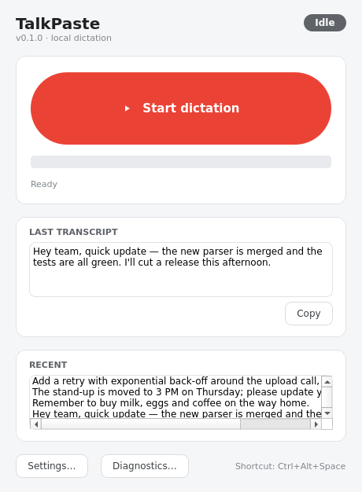
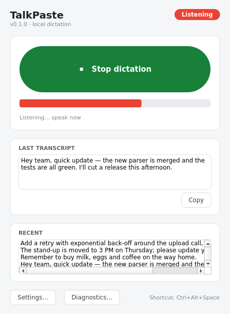
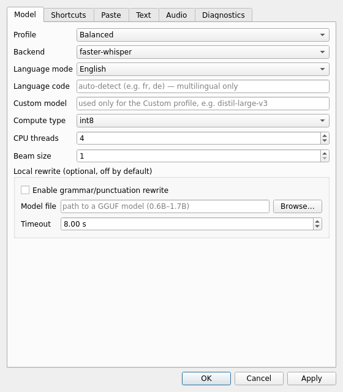
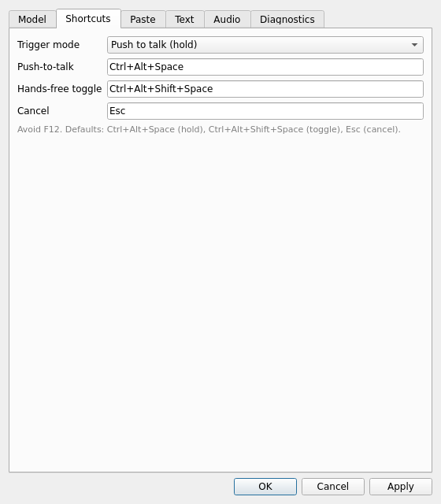

# TalkPaste

**Fully-local, cross-platform push-to-talk dictation for Windows and Linux.**

Hold a global shortcut, speak, release — TalkPaste transcribes your speech
locally with a Whisper-family model, cleans up the text, and pastes it into
whatever app you are focused on. No cloud, no account, no audio ever leaves your
machine.



| Listening | Settings | Shortcuts |
| --- | --- | --- |
|  |  |  |

> Status: early but functional. The headless CLI and the full text pipeline are
> covered by tests; the desktop GUI (main window, tray, settings) and the
> platform adapters are implemented for Windows, Linux/X11 and Linux/Wayland.
> Screenshots are generated by `scripts/capture_screenshots.py`.

---

## Features

- 🎙️ **Speak into any app** — push-to-talk or hands-free toggle, then paste into
  the focused window.
- 🔒 **Local & offline** — transcription runs on-device with
  [faster-whisper](https://github.com/SYSTRAN/faster-whisper) (CPU int8 by
  default). Nothing is uploaded.
- 🧹 **Deterministic cleanup** — filler removal, spoken punctuation and
  formatting commands, snippets, a custom dictionary, developer casing helpers,
  and British-English spelling.
- 🗣️ **Spoken commands** — “new line”, “comma”, “open quote … close quote”,
  “bullet list”, “scratch that”, “snake case …”, and more.
- 🧠 **Optional local rewrite** — grammar/punctuation cleanup via a small local
  GGUF model (off by default, hard-timeout protected).
- 🪶 **Runs on weak PCs** — `tiny.en`/`base.en` profiles, lazy model loading,
  work off the UI thread.
- 🧩 **Clean architecture** — isolated platform adapters and a pluggable ASR
  backend, so pieces can be swapped or rewritten later.

## Supported platforms

| Platform | Hotkeys | Paste injection | Notes |
| --- | --- | --- | --- |
| **Windows 10/11** | Win32 low-level keyboard hook | `SendInput` Ctrl+V | First-class. Injecting into elevated apps needs TalkPaste run as admin. |
| **Linux / X11** | `pynput` global listener | `xdotool` Ctrl+V | Install `xdotool` + `xclip`/`xsel`. |
| **Linux / Wayland** | XDG portal *GlobalShortcuts* | XDG portal *RemoteDesktop*, or opt-in `ydotool` | Best-effort; falls back to copy-only with a clear prompt. See [docs/wayland-notes.md](docs/wayland-notes.md). |

Full detail: [docs/platform-support.md](docs/platform-support.md).

## Install

Requires **Python 3.11+**.

```bash
git clone https://github.com/princeizak/TalkPaste.git
cd TalkPaste
python -m venv .venv && source .venv/bin/activate   # Windows: .venv\Scripts\activate
pip install -r requirements.txt
```

### System dependencies

- **Linux/X11:** `sudo apt install xdotool xclip` (or `xsel`)
- **Linux/Wayland:** `sudo apt install wl-clipboard`; optionally `ydotool`
- **Microphone (all Linux):** `sudo apt install libportaudio2`
- **Windows:** nothing extra — Win32 APIs are used via `ctypes`.

### Models

Models are **not** bundled. faster-whisper downloads the chosen model on first
use into your data directory (`talkpaste config-path` shows where). Profiles:

| Profile | Model | Good for |
| --- | --- | --- |
| `fast` | `tiny.en` | Weak/older CPUs, quick notes |
| `balanced` (default) | `base.en` | Most machines |
| `accurate` | `small.en` | Stronger CPUs, tougher audio |

Multilingual mode uses the non-`.en` variants; a `custom` profile lets you name
any faster-whisper model.

## CLI usage

The CLI works without any GUI installed:

```bash
python -m app.cli --help

# Transcribe a WAV file and print the transcript
python -m app.cli transcribe path/to/file.wav
python -m app.cli transcribe file.wav --json          # with metadata
python -m app.cli transcribe file.wav --raw            # show raw + formatted

# Record from the mic for N seconds, transcribe, optionally paste
python -m app.cli record-once --seconds 5
python -m app.cli record-once --seconds 5 --insert

# Inspect the environment
python -m app.cli list-audio-devices
python -m app.cli diagnose-platform -v

# Run the full dictation loop headlessly (Ctrl+C to quit)
python -m app.cli run-headless

# Control a running instance (bind to a system shortcut on Wayland)
python -m app.cli dictate-toggle
python -m app.cli dictate-cancel

# Config helpers
python -m app.cli config-path
python -m app.cli init-config
```

Backward-compatible convenience launcher:

```bash
python main.py --transcribe file.wav   # same as the transcribe command
python main.py                          # launches the tray GUI
```

## Desktop app

```bash
python -m app.main        # or: python main.py
```

Launches the **main window** plus a persistent tray icon:

- A big **Start / Stop** button (or hold your global shortcut) starts a
  dictation; a live level meter shows your mic input.
- The current state is shown as a coloured pill — **Idle / Listening /
  Processing / Ready / Error** — mirrored by the tray icon and a small popup.
- **Last transcript** and a **Recent** list (double-click any entry to copy).
- **Settings…** — model & profile, language, rewrite, shortcut editor
  (`QKeySequenceEdit`), paste behaviour, audio device, dictionary/snippet
  editors, and a platform-capability diagnostics panel.

**Tray**: left-click (or "Open TalkPaste") reopens the window; the menu also has
Start/stop, Cancel, Recent transcripts, Settings…, Diagnostics… and Quit.
Closing the window hides it to the tray — the app keeps running in the
background. Quit from the tray menu to exit fully.

Default shortcuts (editable, and deliberately not F12):

- Push-to-talk: **Ctrl+Alt+Space**
- Hands-free toggle: **Ctrl+Alt+Shift+Space**
- Cancel: **Esc**

## Spoken commands (a selection)

`new line`, `new paragraph`, `press enter`, `tab`, `comma`, `full stop` /
`period`, `question mark`, `exclamation mark`, `colon`, `semicolon`,
`open`/`close quote`, `open`/`close bracket`, `bullet list`, `numbered list`,
`scratch that`, `undo last phrase`, `snake case …`, `camel case …`. With
developer mode: `kebab case`, `constant case`, `pascal case`, `cli flag …`.

Custom `dictionary.json` (spoken → written) and `snippets.json` (trigger →
expansion) live in your data directory and are editable from the settings UI.

## Data & configuration

Everything is stored per-user (via `platformdirs`); override with the
`TALKPASTE_DATA_DIR` environment variable.

```
settings.json    dictionary.json    snippets.json
history.jsonl    logs/              models/
```

## Development

```bash
pip install -r requirements-dev.txt

# Tests (hermetic; Qt tests run headless). Use the helper to avoid a polluted
# PYTHONPATH leaking foreign pytest plugins:
./scripts/run_tests.sh
# or directly:
env PYTHONPATH= QT_QPA_PLATFORM=offscreen pytest -q

ruff check .            # lint
mypy app                # types

python scripts/make_fixture.py   # regenerate the WAV test fixture
```

## Packaging

Per-OS builds with PyInstaller (no cross-compilation) — see
[packaging/README.md](packaging/README.md):

```bash
./scripts/build_linux.sh                        # Linux  -> dist/talkpaste/
powershell -File scripts\build_windows.ps1      # Windows -> dist\talkpaste\
```

## Troubleshooting

- **“No transcript / empty output.”** Silence or non-speech is filtered by VAD.
  Check `list-audio-devices` and pick the right input in Settings.
- **“Nothing gets pasted.”** Run `diagnose-platform`. On X11 install `xdotool`;
  on Wayland see [docs/wayland-notes.md](docs/wayland-notes.md); on Windows,
  elevated target apps require running TalkPaste as administrator. Copy-only
  mode always works — paste with Ctrl+V.
- **“Global hotkeys don’t fire (Wayland).”** Bind a system shortcut to
  `talkpaste dictate-toggle` (needs a running `run-headless`/tray instance).
- **“PortAudio library not found.”** `sudo apt install libportaudio2`.
- **Slow first transcription.** The model downloads/loads lazily on first use;
  it is cached afterwards. Try the `fast` profile on weak machines.
- **Logs** live in `<data-dir>/logs/talkpaste.log` (`config-path` to locate).

## Project layout

```
app/
  cli.py  main.py  config.py  logging_setup.py  models.py
  services/   audio_engine, asr_base, asr_faster_whisper, asr_whisper_cpp,
              formatter, commands, dictionary_store, snippets_store,
              history_store, rewrite, controller, clipboard, ipc
  platform/   base, hotkeys, windows_adapter, linux_x11_adapter,
              linux_wayland_adapter
  ui/         tray_app, settings_window, status_popup
tests/    docs/    scripts/    packaging/
```

More: [docs/how-it-works.md](docs/how-it-works.md).

## Licence

[MIT](LICENSE).
